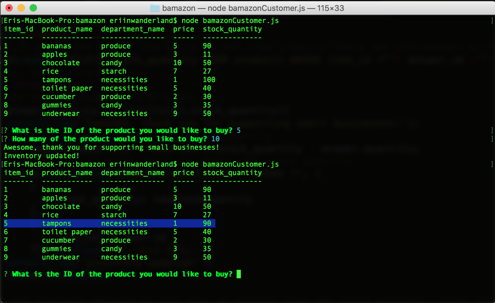
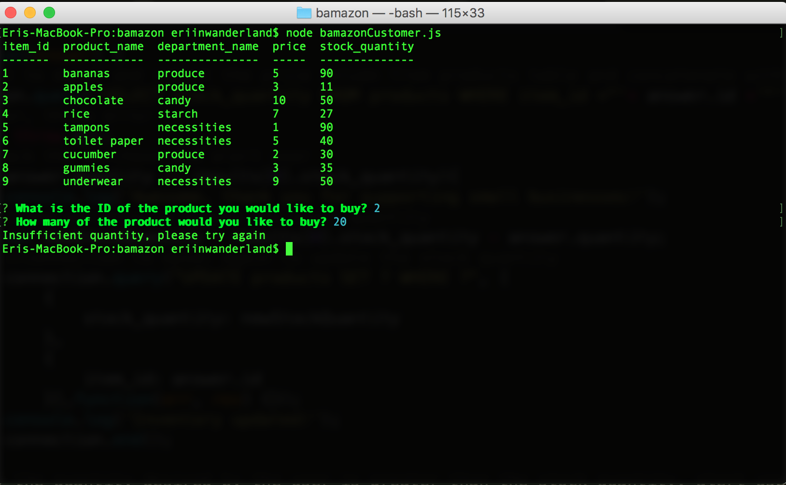

# Bamazon

	A simple shopping app that utilizes node and MySQL to track inventory and customer purchases. 

## Functions

	Customers are able to see a table populated with the most up-to-date stock of the inventory as well as purchase their desired amount of products. If they request for a quantity of a product that is more than what is in stock, the customer is notified of the insufficient quantity. 

	Below are screenshots of the functionality of the application: 

	When the shopping app is opened, a table filled with product data is shown and the customer is prompted with two questions. Upon answering those questions, the inventory is updated: 
	
;

	As you can see below, upon running the application again, the highlighted portion shows the inventory of the previously purchased product being updated: 

;

	If the customer attempts to purchase an amount of a product that is over the stock quantity, the customer is alerted that there is an insufficient quantity of the product: 

;

## Contributor

	Eri Nagase

## Technologies Used

	Javascript

	nodeJS

	npm packages:
		MySQL
		Inquirer
		Console.table

	MySQL

## License
	Copyright 2017 UC Berkeley Extension Coding Bootcamp - Eri Nagase